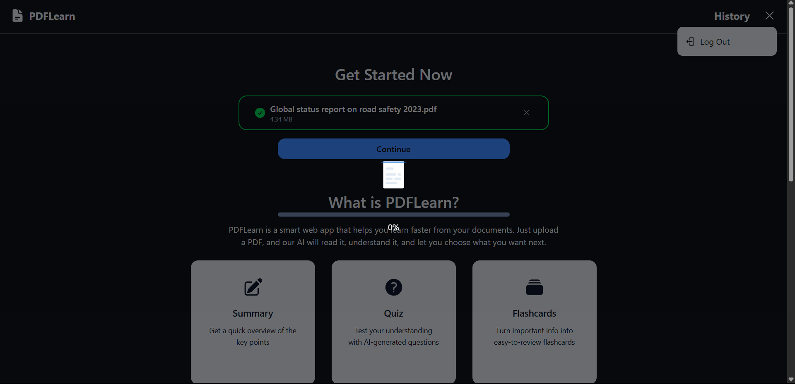
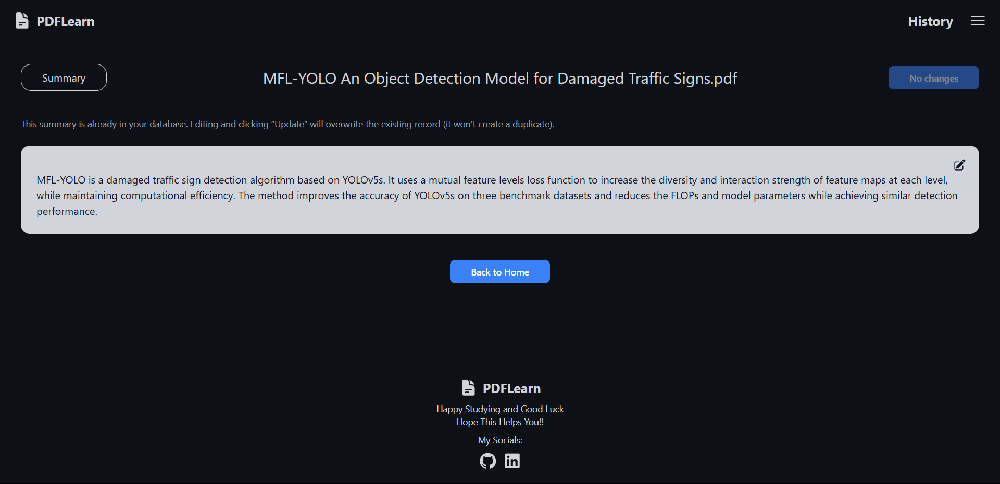
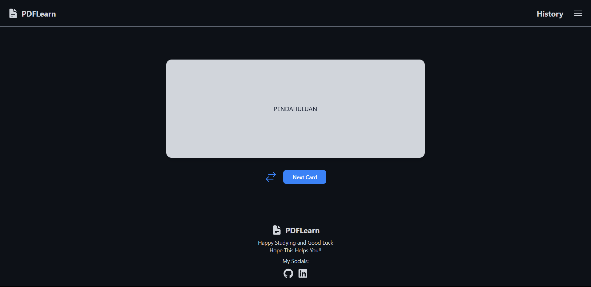
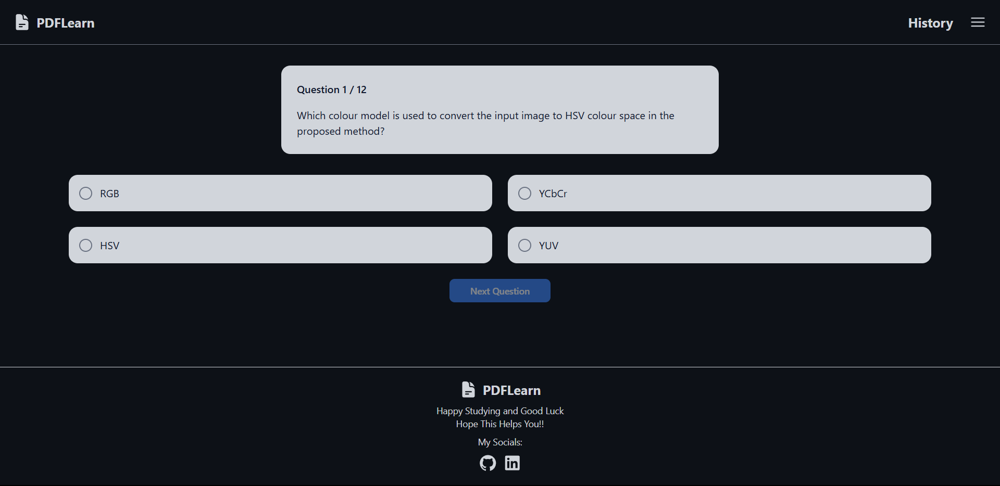

# 📚 PDFLearn

PDFLearn is a web app that helps users learn faster from their documents. Simply upload a PDF, and let the AI generate:

- Create a concise **summary**

- Create a study-ready **flashcards**

- Create an interactive **quiz**

Built with Next.js, Supabase, and Hugging Face’s Mistral-7B, PDFLearn is ideal for students, researchers, and professionals who want to save time and boost understanding.

